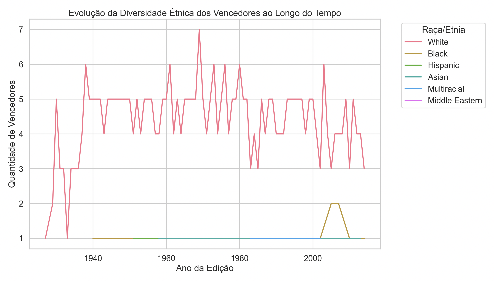

# Projeto de Análise de Dados - Explorando os Vencedores do Oscar 🎥

Este repositório contém uma análise detalhada e visualizações sobre padrões demográficos dos vencedores do Oscar ao longo de diferentes décadas, com foco em idade, etnia, religião, orientação sexual e categorias premiadas.

## Equipe Responsável 👩‍💻👨‍💻
- Brenno Viana Coelho - 202022642
- Julia Reis Rodrigues - 202212049
- João Pedro de Abreu - 202210964

## Objetivos do Projeto 🎯

### Objetivo Principal
Investigar padrões demográficos entre os vencedores do Oscar, identificando como variáveis como idade, etnia, religião e orientação sexual evoluíram ao longo do tempo.

### Perguntas de Pesquisa
- **Diversidade Étnica**: Como a diversidade étnica dos vencedores mudou ao longo das décadas?
- **Idade nas Categorias**: Há alguma tendência entre a idade dos vencedores e as categorias premiadas?
- **Influência Temporal**: Existe correlação entre o ano da premiação e a idade ou outros fatores demográficos dos vencedores?
- **Distribuição Religiosa e de Gênero**: Quais são as proporções de religiões e gêneros entre os vencedores ao longo das décadas?

## Estrutura do Repositório 📁
- `data/`: Contém o arquivo de dados utilizado na análise (`world_ampas_oscar_winner_demographics.csv`).
- `notebooks/`: Jupyter Notebook com o código completo para a análise exploratória.
- `images/`: Gráficos gerados durante a análise.
- `README.md`: Este documento explicativo.

## Descrição da Base de Dados 📋
A base de dados contém informações sobre os vencedores do Oscar, incluindo:
- `birth_year`: Ano de nascimento.
- `year_edition`: Ano da edição do Oscar.
- `category`: Categoria premiada.
- `race_ethnicity`: Etnia.
- `religion`: Religião declarada.
- `sexual_orientation`: Orientação sexual.
- `gender`: Gênero.

### Tratamento dos Dados Ausentes
- **Valores categóricos**: Substituídos por "Desconhecido".
- **Valores numéricos**: Substituídos pela mediana do conjunto de dados.

## Ferramentas e Tecnologias Utilizadas 🛠️
- **Python**: Análise de dados e visualizações (Pandas, NumPy, Matplotlib, Seaborn).
- **Jupyter Notebook**: Ambiente para desenvolvimento e apresentação.
- **GitHub**: Repositório para colaboração e controle de versão.

## Principais Funcionalidades e Visualizações 📊
- **Tratamento de Dados e Novas Colunas**:
  - Criação da coluna `age_at_award`, representando a idade dos vencedores no momento da premiação.
  - Encoding das variáveis categóricas para facilitar análises estatísticas.
  - Criação da coluna `decade` para análises temporais.
  
- **Distribuição de Vencedores por Década**:
  - Gráfico de barras mostrando a evolução do número de vencedores ao longo das décadas.

- **Idade dos Vencedores por Categoria**:
  - Gráfico de boxplot que visualiza a distribuição da idade dos vencedores em cada categoria.

- **Evolução da Diversidade Étnica**:
  - Linha do tempo representando a diversidade étnica ao longo das edições do Oscar.

- **Distribuição de Religiões entre os Vencedores**:
  - Gráfico de barras mostrando as proporções de religiões entre os vencedores.

- **Distribuição de Orientações Sexuais**:
  - Gráfico de barras para proporções de diferentes orientações sexuais entre os vencedores.

- **Correlação entre Ano de Edição e Idade**:
  - Gráfico de dispersão mostrando a relação entre o ano da premiação e a idade dos vencedores.

- **Distribuição de Gênero entre os Vencedores**:
  - Gráfico de barras ilustrando a proporção de gêneros entre os vencedores.

## Respostas às Perguntas de Pesquisa 🧐

- **Diversidade Étnica**:  
  A diversidade étnica dos vencedores do Oscar aumentou ao longo das décadas, especialmente nas categorias técnicas. As categorias principais, como Melhor Ator/Atriz, ainda mostram uma predominância de etnias majoritárias, mas houve progresso significativo em categorias secundárias e técnicas.

- **Idade nas Categorias**:  
  Observamos que os vencedores das categorias técnicas, como Melhor Efeitos Visuais e Melhor Cinematografia, tendem a ser mais jovens, enquanto as categorias principais, como Melhor Ator/Atriz, apresentam vencedores em faixas etárias mais avançadas, com uma tendência crescente de reconhecimento para atores mais velhos nas últimas décadas.

- **Influência Temporal**:  
  Existe uma correlação entre o ano da premiação e a diversidade demográfica dos vencedores. A partir dos anos 2000, há uma crescente inclusão de etnias e orientações sexuais diversas, refletindo os esforços da Academia para diversificar as premiações.

- **Distribuição Religiosa e de Gênero**:  
  As proporções de gênero entre os vencedores tendem a ser desproporcionais, com uma predominância de vencedores masculinos. As informações sobre religião são limitadas, mas observamos uma tendência de predominância de vencedores declaradamente cristãos, com uma falta de dados para outras religiões.

## Principais Conclusões 📚
- **Tendências Étnicas**:
  A diversidade étnica apresentou crescimento ao longo das décadas, com categorias técnicas sendo mais diversas em comparação às categorias principais, como Melhor Ator/Atriz.

- **Idade dos Vencedores**:
  As categorias técnicas tendem a premiar vencedores mais jovens, enquanto categorias principais apresentam vencedores de faixas etárias mais avançadas.

- **Religião e Orientação Sexual**:
  Muitas informações ainda são desconhecidas, refletindo uma falta de representatividade histórica nesses dados.

- **Influência Temporal**:
  Existe uma correlação entre o ano da premiação e a diversidade geral, mostrando que esforços por inclusão no cinema têm impactado as escolhas da Academia.

- **Categorias Técnicas x Principais**:
  As categorias técnicas exibem maior diversidade em termos de etnia e idade, enquanto as categorias principais permanecem mais homogêneas.

---

Feito com ❤️ e Python 🐍
