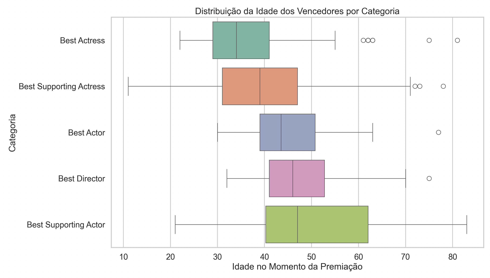

# Análise Exploratória de Dados: Demografia dos Vencedores do Oscar ao longo dos anos 

Grupo: 
Brenno Viana Coelho - 202022642
Julia Reis Rodrigues - 202212049
João Pedro de Abreu - 202210964

## Compreensão do Problema e dos Dados 📋 

Esta análise investiga **padrões demográficos** entre os vencedores do Oscar ao longo dos anos. O objetivo é identificar como variáveis como **ano de nascimento e etnia,** e  refletiram nos resultados das premiações ao longo das ediçoēs.

---

## Exploração Detalhada dos Dados 🔍 

O conjunto de dados contém as seguintes informações sobre os vencedores:

- **`birth_year`**: Ano de nascimento  
- **`race_ethnicity`**: Etnia  
- **`year_edition`**: Ano da edição do Oscar  
- **`category`**: Categoria do prêmio  

---

## 🎯 Identificação da Pergunta de Pesquisa

**Pergunta Principal:**  
Quais são os padrões demográficos dos vencedores do Oscar ao longo dos anos?

### Subperguntas:

1. **Diversidade Étnica:**  
   Há mudanças na diversidade étnica dos vencedores ao longo das décadas?

2. **Idade nas Categorias:**  
   Existe alguma tendência relacionada à idade dos vencedores nas diferentes categorias?

---

## 💡 Objetivo

- Identificar **tendências** na diversidade étnica entre vencedores em diferentes décadas.
- Verificar se há **mudanças na idade** dos premiados ao longo dos anos.
- Analisar a **distribuição de orientação sexual e religião** entre os vencedores.

---

## 🛠️ Tecnologias Utilizadas

- **Python**: Para análise de dados (Pandas, NumPy, Matplotlib, Seaborn)
- **Jupyter Notebook**: Para desenvolvimento e visualização dos dados
- **GitHub**: Repositório para versionamento e colaboração

---

## 📊 VisualizaçõesGráficos

As análises incluirão gráficos e tabelas para facilitar a compreensão dos dados. A seguir estão alguns exemplos de visualizações planejadas:

- **Gráficos de barras**: Distribuição de Vencedores por Ano (Agrupado por Década).

- **Gráficos de velas**: Idade dos Vencedores por Categoria.

- **Gráfico de linhas**: Para verificar a evolução da diversidade Étnica ao longo do tempo. 

---

Feito com ❤️ e Python 🐍
